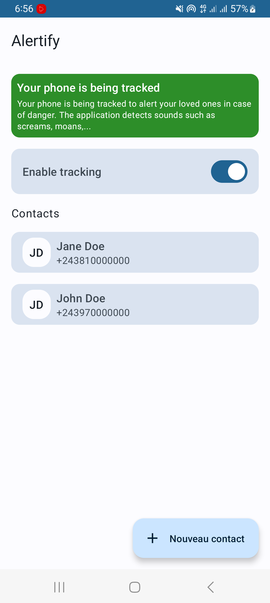
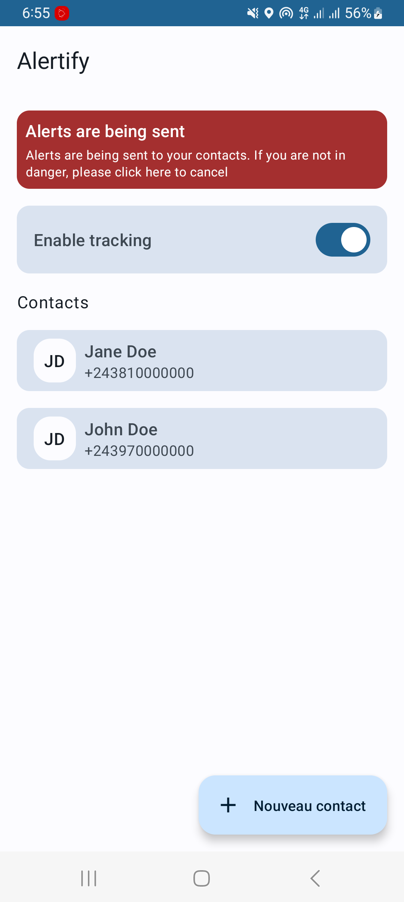
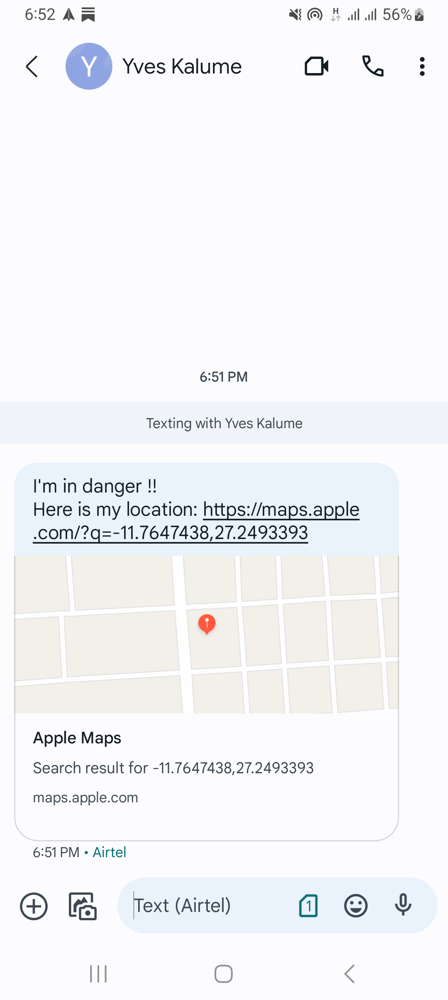
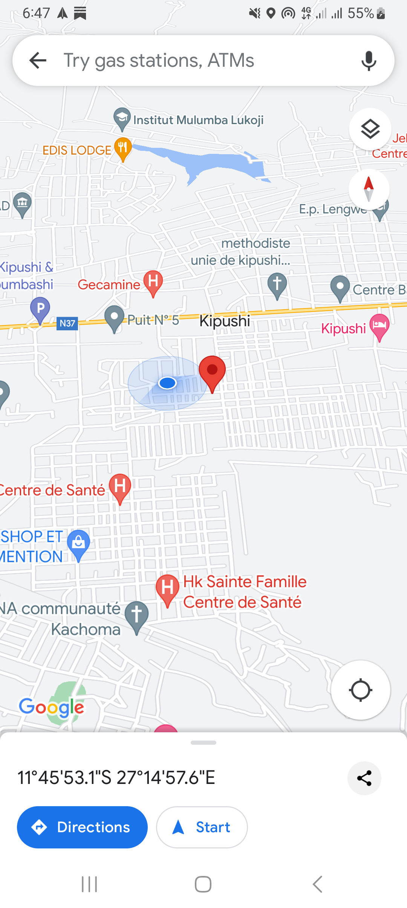

# alert-app-ml-poc

## Description

This is a proof of concept for an offline alert app designed to assist individuals in danger,
particularly those who may have been kidnapped, in alerting their emergency contacts without the
need to click any buttons on their phone.

The app utilizes the phone's microphone and on-device machine learning, specifically for sound
classification, to identify if the user is in a perilous situation. If a potential danger is
detected, alert messages containing the user's location are sent to their designated emergency
contacts.

🚧 **Note** : _This app is currently in an experimental phase and is presented for conceptual and
exploratory
purposes. It may not function reliably in all scenarios. Users are strongly advised against relying
on this app for critical safety needs._ 🚧

## Screenshots

&nbsp;
&nbsp;
&nbsp;
&nbsp;

## Why this project ?

This POC specifically addresses the challenges posed by scenarios where conventional methods of
alerting, such as clicking buttons, might be impractical or unsafe. By relying on the phone's
microphone and on-device machine learning, the goal is to provide an automated and discreet system
that can operate without direct user engagement. This is especially important in situations where
physical or psychological constraints prevent individuals from actively using their phones to seek
help.

## Challenges

- Ensuring the reliability of sound recognition in noisy environments poses a challenge. External
  noises could interfere with the accuracy of the sound classification model, potentially leading to
  false detections.

- Currently, there is no dataset available for sounds associated with kidnapping scenes.
  Therefore, I employed Yamnet, a sound classification model trained on AudioSet.
  I focused on detecting specific sounds such as "groan," "whimper," "crying," "sobbing," and "
  screaming," which could be indicative of a kidnapping scenario.

- Furthermore, the choice to operate the app offline addresses practical concerns such as preserving
  battery life and ensuring functionality in areas with unreliable internet connectivity.

## Some ideas to enhance the project

Here are some ideas to enhance the app:

- Explore integration with wearable health devices to gather additional biometric data, such as
  heart rate and stress levels. This information could provide valuable context for danger detection
  and enhance the app's overall effectiveness.

- Enable real-time communication between the app and local emergency services. This could facilitate
  quicker response times and provide emergency personnel with crucial information about the user's
  situation.

- The app could incorporate the ability to record sounds. In cases where the user has an internet
  connection, these sounds could be transmitted to a server. This approach may aid in creating a
  dataset and training a custom model specifically for detecting kidnapping scenarios.

## Resources

- [MediaPipe](https://developers.google.com/mediapipe)
- [Yamnet](https://www.kaggle.com/models/google/yamnet/frameworks/tensorFlow2/variations/yamnet/versions/1)
- [AudioSet](https://research.google.com/audioset/)

## License

```
Designed and developed by 2023 yveskalume (Yves Kalume)

Licensed under the Apache License, Version 2.0 (the "License");
you may not use this file except in compliance with the License.
You may obtain a copy of the License at

   http://www.apache.org/licenses/LICENSE-2.0

Unless required by applicable law or agreed to in writing, software
distributed under the License is distributed on an "AS IS" BASIS,
WITHOUT WARRANTIES OR CONDITIONS OF ANY KIND, either express or implied.
See the License for the specific language governing permissions and
limitations under the License.
```